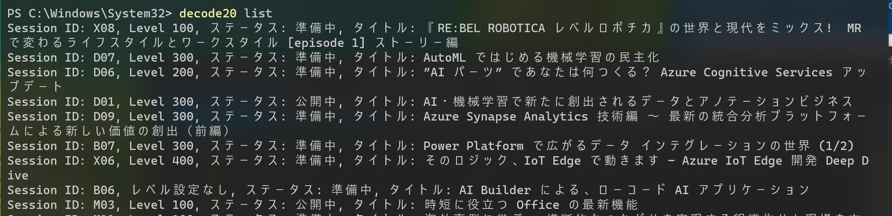
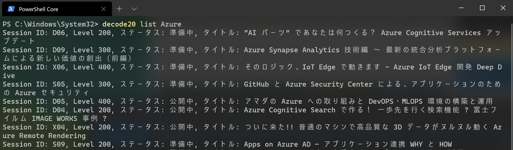
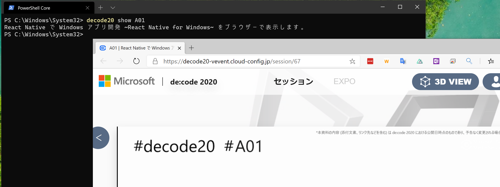

# de:code 2020 CLI（非公式）

de:code 2020 のセッションサイトからダウンロードできるセッションリストを Web API として取得できる Swagger ファイルを [@TaikiYoshidaJP](https://twitter.com/TaikiYoshidaJP?s=20) さんが [de:code 2020 セッション検索用非公式Power Apps](https://github.com/taiki-yoshida/decode2020-powerapps) で公開していて、この API 叩いていいか聞いてみたら快諾していただいたので、単純に CLI からたたけるようにしてみました。

## インストール

dotnet のグローバル ツールとしてインストールできます。

NuGet のサイトは以下になります。

[NuGet Gallery | Decode2020.Cli](https://www.nuget.org/packages/Decode2020.Cli/)

.NET Core 3.1 の SDK をインストールして以下のコマンドでインストールしてください。

```
$ dotnet tool install --global Decode2020.Cli --version 1.0.0
```

## 使い方

### セッション一覧の表示

```
$ decode20 list
```



### キーワードでタイトルを絞り込んで表示

```
$ decode20 list Azure
```



### セッション ID の動画閲覧サイトを開く

```
$ decode20 show A01
```


